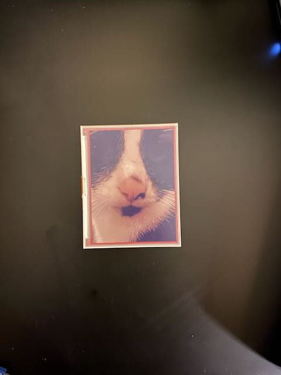
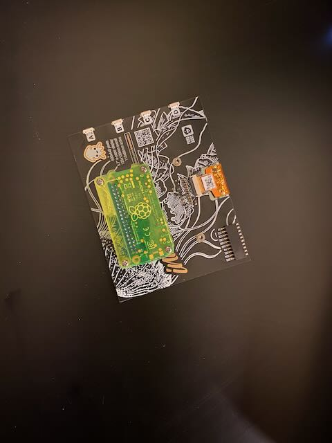

# Inky Frame

A smol project using raspberry pi zero to use an e-ink display as a photo frame.

<div style="height: 250px; display: flex; flex-direction: row;">
    
    
</div>

## Hardware

- Raspberry Raspberry Pi 5 or Pi Zero 2W
- [Pimoroni Inky e-ink Display](https://shop.pimoroni.com/products/inky-impression-7-3?variant=40512683376723)

# Only for Pi Zero 2W

- Soldering Iron
- header pins

## Software Setup

Flash an SD card with Raspian using [RPI imager](https://www.raspberrypi.com/software/) to take advantage of autosetup for wifi, and ssh keys.

### Raspberry Pi 5

Build and push the docker image to your registry of choice:

- `docker build -t <registry>/frame:0.0.1 . --platform=linux/arm64`
- `docker push <registry>/frame:0.0.1`
- Run using:
  `docker run --rm -d --name inky_frame --privileged --restart unless-stopped -v /home/notedwin/images:/app/images <registry>/frame:0.0.1`

you can follow my deploy.sh script for more details.

## Raspberry Pi Zero 2 W

On your local machine, run:

```bash
#!/bin/bash
set -e

# TODO: seprate first time setup and redeploy

# set a variable for host
host=""

# https://www.complete.org/installing-debian-backports-on-raspberry-pi/
- name: Add debian keyring download deb pkg
  ansible.builtin.get_url:
    url: "http://http.us.debian.org/debian/pool/main/d/debian-archive-keyring/debian-archive-keyring_2023.4_all.deb"
    dest: "/tmp/debian-keyring.deb"

- name: Install debian keyring
  ansible.builtin.apt:
    deb: "/tmp/debian-keyring.deb"
    state: present

- name: Add debian backports
  ansible.builtin.apt_repository:
    repo: "deb http://deb.debian.org/debian bookworm-backports main"
    state: present

- name: Update and Upgrade
  ansible.builtin.apt:
    upgrade: dist
    update_cache: true

- name: Install from Backports
  ansible.builtin.apt:
    name:
      - libheif-dev
      - libheif1
    default_release: bookworm-backports

apt-get
      - curl
      - python3
      - python3-pip
      - git
      - tmux
      - neovim
      # piheif
      - libjpeg-dev
      - zlib1g-dev
      # numpy piwheel
      - libopenjp2-7
      - libatlas-base-dev
      - libgfortran5
      - libopenblas0-pthread

scp .env "${host}":~/src/.env
scp frame.py "${host}":~/src/frame.py

scp pyproject.toml "${host}":~/src/pyproject.toml


curl -LsSf https://astral.sh/uv/install.sh | sudo env UV_INSTALL_DIR="/usr/bin" sh
ssh "${host}" "echo '@reboot /usr/bin/uv run --project /home/notedwin/src /home/notedwin/src/frame.py >> /home/notedwin/log 2>&1' | crontab -"

# disable powersave, cause it will disconnect the wifi
ssh "${host}" "sudo nmcli con mod preconfigured wifi.powersave disable"
ssh "${host}" "/usr/sbin/iw wlan0 set power_save off"

# on the pi, install the following packages
uv pip install gpiozero pi-heif pillow python-dotenv requests schedule inky
uv pip install pi-heif --index-url https://pypi.org/simple
```

### Inspiration

[hitherdither](https://github.com/hbldh/hitherdither?tab=readme-ov-file#id4)

[frameos](https://github.com/FrameOS/frameos/)
